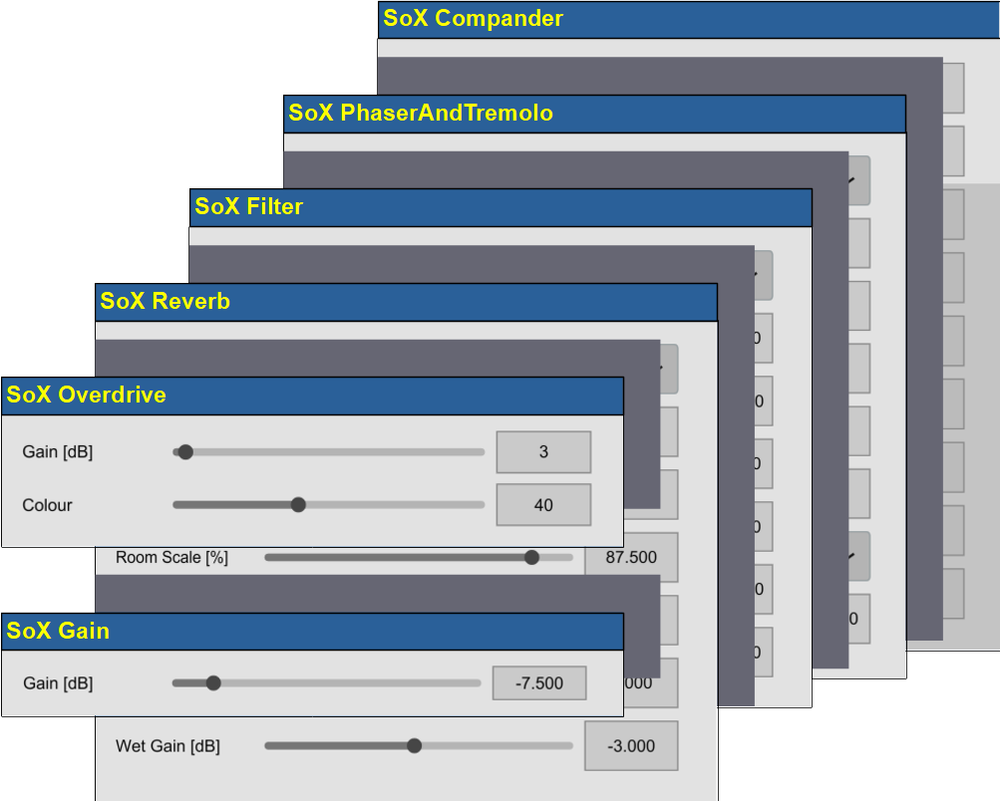
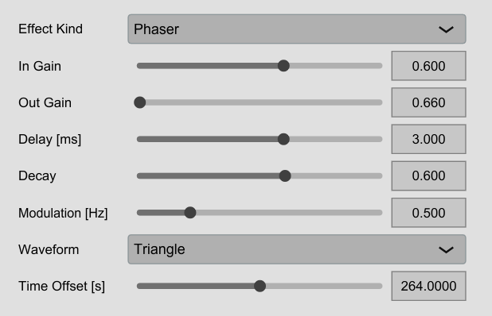
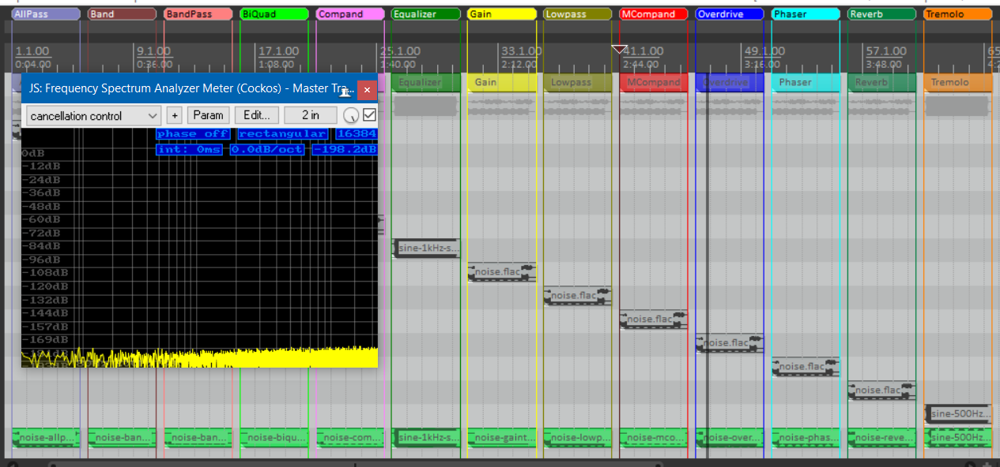

<TABLE CELLSPACING="0" CELLPADDING="0">
  <TR>
    <TH>
      <H1>SoX Plugins for DAWs</H1>
    <TH>
      
    </TH>
  </TR>
</TABLE>

Overview
--------

The SoX Plugins software package provides plugins for being used in
digital audio workstations (DAW); they implement some of the audio
processing effects from SoX.  

*[SoX][reference:SoX]* is a command line audio processing tool for
Unix, Windows and Mac OS that transforms source audio files in several
formats into other audio files.  It provides several standard audio
effects (like e.g. filters or reverb) in good quality and with a
transparent, open-source implementation.  Currently a project called
[SoX_ng][reference:SoXNG] and led by Martin W. Guy is modernizing all
those effects and hence serves as the reference for this project.

The effects provided here are a complete rewrite in
C++ of the SoX algorithms for producing
*(bit-exact) identical* renderings in the DAW.  This can easily be
checked by rendering some audio externally with SoX and internally
with the plugins and subtracting the results.  Apart from roundoff
errors (SoX often uses 32bit integer processing, while the SoXPlugins
always uses double floating point processing) the results cancel out
with typically a residual noise of -140dBFS.

The main motivation for this package is to be able to play around with
effects in a DAW and be sure that the external rendering by SoX will
produce exactly the same results.  Although SoX does not always
provide the "best" effects, it still is a reliable and well-defined
audio tool.

Only a selection of SoX effects has been reimplemented as plugins, but
those are the ones that are - in my opinion - the more prominent
effects in that suite.

Because SoX very often uses rich command line options for its effects,
not every effect configuration from SoX can be fully transported into
the slider oriented GUI for a plugin.  E.g. the compander of SoX
allows the definition of a transfer function having multiple segments.
Although the internal engine of the SoXPlugins compander implements
exactly the same internal segment logic, the user interface only
allows the typical definition of a threshold and a compression ratio
(with three segments).

Note also that a spiffy user interface is *not at all* a priority in
this project.  Also their parameter ranges are somewhat debatable, but
they simply reflect the wide parameter ranges of the SoX command-line
effect.

The redesign and restructuring has also been done for easier
maintenance, because there is some redundancy and unnecessary
complexity in the original sources due to their several contributors.
Nevertheless - as pointed out - the effects provided here faithfully
model the SoX command-line processing.

This plugin implementation is completely free, open-source,
platform-neutral and based on the *[JUCE][reference:JUCE]* audio
framework.  Currently only plugin versions as VST3 under Windows 10,
VST3 and AU under MacOSX (x86_64) and VST3 under Linux (x86_64) are
provided, but porting to other targets should be straightforward,
since building is supported by a platform-neutral CMAKE build file.

Available Effects
-----------------

The following effects are available in this package:

  - *allpass*: a biquad allpass filter two-poled with filter frequency
    and the filter bandwith (in several units)

  - *band*: a biquad bandpass filter with center filter frequency and
    the filter bandwith (in several units) and an option for unpitched
    audio

  - *bandpass*: a biquad filter for bandpass with center filter
    frequency and the filter bandwith (in several units)

  - *bandreject*: a biquad filter for bandreject with center filter
    frequency and the filter bandwith (in several units)

  - *bass*: a biquad filter for boosting or cutting bass with a
    shelving characteristics with settings for filter frequency and
    the filter bandwith (in several units)

  - *biquad*: a generic biquad (iir) filter with 6 coefficients
    b0, b1, b2, a0, a1 and a2

  - *chorus*: a chorus effect with multiple parallel echos modulated
    either by sine or triangle signals,

  - *compand*: a compander with attack, release, input gain
    shift, threshold and compression and soft knee; this
    is a reduced version of SoX compand with only a
    simple transfer function

  - *echo*: a tapped delay with several absolute delay times and
    signal decays,

  - *echos*: a sequential delay with delay stages with absolute
    delay times and signal decays fed with signals from the previous
    stages,

  - *equalizer*: a biquad filter for equalizing with
    settings for the pole count, the filter frequency
    and the filter bandwith (in several units)

  - *gain*: a volume changer by _exact_ decibels...

  - *highpass*: a biquad filter for highpass with settings for the
    pole count, the filter frequency and the filter bandwith (in
    several units)

  - *lowpass*: a biquad filter for lowpass with settings for the pole
    count, the filter frequency and the filter bandwith (in several
    units)

  - *mcompand*: a multiband compander with a Linkwitz-Riley crossover
    filter and for each band a compander with attack, release, input
    gain shift, threshold and compression and soft knee; again the
    companders only allow a simple transfer function

  - *overdrive*: a simple tanh distortion with gain and colour
    specification

  - *phaser*: a phaser effect with sine or triangle modulation

  - *reverb*: a reverb effect (based on Freeverb) with several
    parameters for the room (like size and HF damping) as well as a
    possible predelay

  - *treble*: a biquad filter for boosting or cutting treble with a
    shelving characteristics with settings for filter frequency and
    the filter bandwith (in several units)

  - *tremolo*: a tremolo effect with sine modulation using a
    double-sideband suppressed carrier modulation

Installation
------------

The installation is as follows:

    1. Expand the appropriate binary archive of the
      <TT>SoXPlugins</TT> for your platform from this
      [repository](../../releases) into the directory for VST plugins
      of your DAW.

   2. The distribution also contains a documentation [pdf
      file](./SoXPlugins-documentation.pdf) in subdirectory doc and
      test files in subdirectory test (for details on the regression
      test see below).

   3. When installing the plugins on MacOSX, note that those are
      **not signed**; so you have to explicitly remove the quarantine
      flag from them (e.g. by applying the command `sudo xattr -rd
      com.apple.quarantine vstPath`).

   4. When installing the plugins on Windows, they require the
      so-called *Microsoft Visual C++ Redistributable* library.  Very
      often this is already installed on your system; if not, you have
      to install it from the [Microsoft][VCCLib] site.

   5. Restart your DAW and rescan the plugins.  You should now be
      able to select the SoXPlugins (they are all prefixed with
      "SoX").

Plugin Example - Phaser
-----------------------

The above diagram gives an example for one of the plugins: this is the
UI for the phaser effect.

Here `In Gain` is the amplification factor for the input in decibels.
`Delay` gives the delay in milliseconds, `Decay` a factor for the
decay within the phaser and `Frequency` gives the modulation frequency
in Hz. The `Waveform` of the modulation is either sinusoidal or
triangular. `Out Gain` is the volume of the output.

If you are acquainted with the SoX command-line effects, you can see
that this is a direct representation of the parameter list in the
`phaser` effect.

Testing the Plugins
-------------------

If you want to run the test, you also have to have a SoX installation.
The test script "makeTestFiles.bat" or "makeTestFiles.sh" in the
[test](./DISTRIBUTION/test) directory assumes that SoX is available in
the program search path.

The test script produces several sound and noise files and applies SoX
audio effects to produces result audio files.

Since there are so many DAWs available, it is hard to provide a test
project for each of those.  The distribution contains a Reaper project
referencing those audio test files and result files in autonomous
tracks. Adaption to other DAW should be straightforward.

The project file "testSoXPlugins.rpp" for the Reaper DAW references
those test and result files and applies the corresponding effect
plugins.  Ideally (because the result files have inverted phase),
everything should cancel out as shown here:

Details
-------

The detailed user manual can be found
*[here][reference:manual]*.

Acknowledgements
----------------

This project is a derivative work based on the foundations laid by the
SoX community.  Although the algorithms used were modified and
redesigned, this project would been much more complicated and tedious
without this basis.

Hence my thanks go to Chris Bagwell, Nick Bailey, Martin W. Guy,
Daniel Pouzzner, Måns Rullgård, Rob Sewell and all the other
contributors of the SoX project: without your effort this would not
have been possible!

## License

There are two license models for this project:

  - The source code is provided with an [**MIT license**](./LICENSE.txt).

  - The VST and AU files given in the release are provided with an [**AGPL v3 license**](BINARY_LICENSE.txt) since they contain parts of the JUCE framework.

This means that if you do *not* use the given binaries and compile the source code by yourself, the MIT license applies.  If you *do* use the binaries, then the AGPL v3 license applies.

[reference:JUCE]: http://www.juce.com/
[reference:manual]: ./SoXPlugins-Documentation.pdf
[reference:reaJS]: https://www.reaper.fm/reaplugs/
[reference:SoX]: http://sox.sourceforge.net/
[reference:SoXNG]: https://codeberg.org/sox_ng/sox_ng
[reference:VCCLib]: https://learn.microsoft.com/cpp/windows/latest-supported-vc-redist
